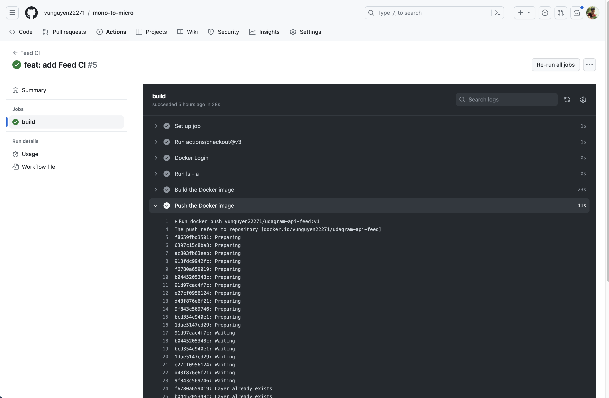

# Screenshots

## Deployment Pipeline
* DockerHub showing containers that I have pushed

* GitHub repository’s settings showing my GitHub Action CI
Feed CI


* GitHub Action showing a successful build and deploy job - 
Feed CI build successfully


- Note: I device to 4 build for case that when I have small change in 1 service, GitHub Action will only build that service.


## Kubernetes
* To verify Kubernetes pods are deployed properly
```bash
kubectl get pods
```

* To verify Kubernetes services are properly set up
```bash
kubectl describe services
```


* To verify that you have horizontal scaling set against CPU usage
```bash
kubectl describe hpa
```


* To verify that you have set up logging with a backend application
```bash
kubectl logs backend-user-855f8bd9c7-f846s 
```


Frontend URL: http://a9727382fff2f46329967d369c07d47e-1271900169.us-east-1.elb.amazonaws.com/


Backend URL: http://a6542bfe502154f7cbcd98c48ce30cbf-1892719817.us-east-1.elb.amazonaws.com:8080/api/v0/feed

